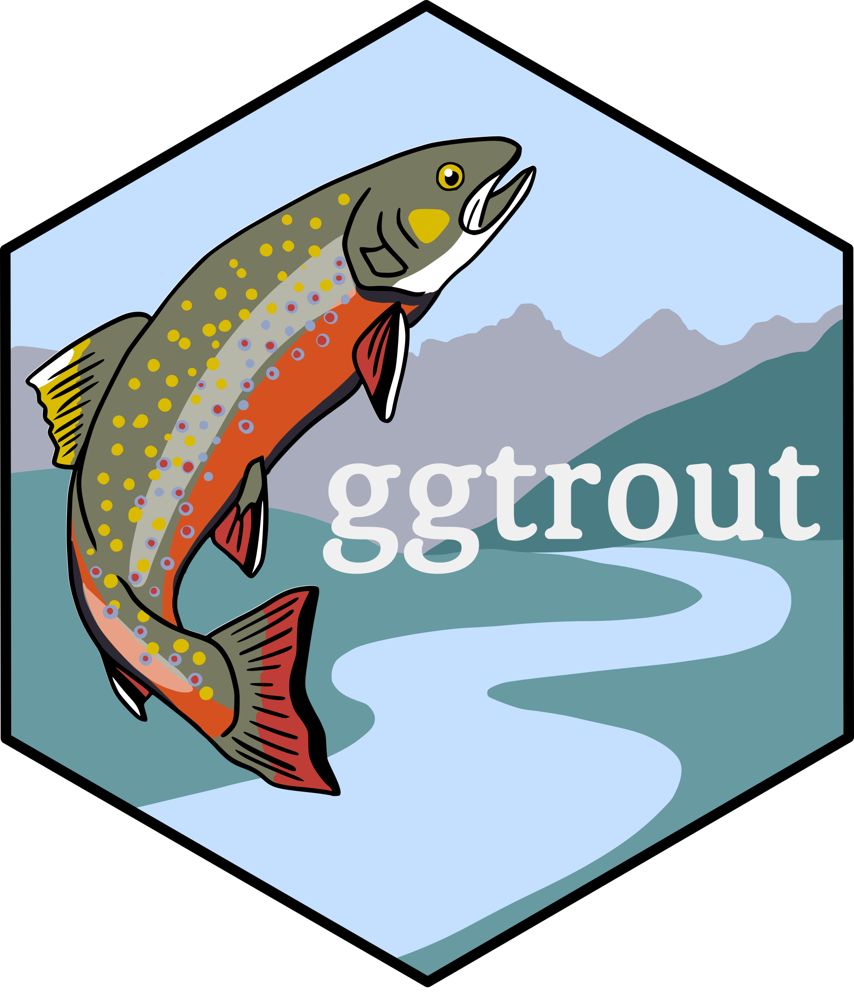

<!-- README.md is generated from README.Rmd. Please edit that file -->

```{r, include = FALSE}
knitr::opts_chunk$set(
  collapse = TRUE,
  comment = "#>",
  fig.path = "man/figures/README-",
  out.width = "100%"
)
```

# ggtrout 

Are you so obsessed with trout that you want to incorporate their coloration into your data visualizations? Look no further! This package provides ten color palettes inspired by several species (and subspecies) of trout that inhabit pristine habitats across the United States. The package's framework is designed for use in the tidyverse but can also be used for base R plotting.

## Installation

------------------------------------------------------------------------

The ggtrout package is only available on GitHub and so must be installed using the devtools package:

``` r
devtools::install_github("eachambers/ggtrout")
```

## Usage

------------------------------------------------------------------------

```{r usage}
# Load library
library(ggtrout)

# See all available palettes
names(ggtrout_palettes)
```

There are 10 palettes available in the ggtrout package, each named based on the species for which the palette is inspired. Five are qualitative, three are diverging, and two are monochromatic. You can have the package tell you which is which using the `ggtrout_types()` function. For example:

```{r palette types, message = FALSE}
library(dplyr)
library(tibble)

# For an individual palette's type:
ggtrout_type("rainbow2")

# For only monochromatic palettes:
ggtrout_type("monochromatic")

# For all palettes:
ggtrout_type("all")
```

You can check the degree of colorblind friendliness for each of the ggtrout palettes using the `ggtrout_cb()` function. In general, the diverging palettes (i.e., "brook1", "cutthroat1", and "rainbow1") are the most colorblind friendly. This function uses the `palette_check()` function in the colorblindcheck package; a general rule of thumb is to select palettes that have a min_dist of \~8 for all color vision deficiencies.

```{r colorblind, message = FALSE}
library(colorblindcheck)

ggtrout_cb("brook1")
```

## Palettes

------------------------------------------------------------------------

Let's go through all the palettes, grouped by (sub)species.

### Brook trout

Brook trout (*Salvelinus fontinalis*), when breeding, have bright orange-red pelvic and pectoral fins and brilliant red lateral spots ringed with a grey-blue. There are three brookie-inspired palettes.

```{r brookie1, message = FALSE}
ggtrout_palette("brook1")
```

```{r brookie2, message = FALSE}
ggtrout_palette("brook2")
```

```{r brookie3, message = FALSE}
ggtrout_palette("brook3")
```

### Cutthroat trout

Cutthroat trout (*Oncorhynchus clarkii*) are named for their bright blood-red fin arch coloration. This species has many subspecies, and the ggtrout package is inspired by two Coloradan subspecies: the Colorado River cutthroat (*O. c. pleuriticus*) and the greenback cutthroat (*O. c. stomias*). The greenback has a fun history: it was presumed extinct in the 1930s until its rediscovery in a restricted river basin in Colorado in 1957. Since then, massive conservation efforts have been focused on reintroducing the subspecies into its historic range; the greenback is also the state fish of Colorado! There are four cuttie-inspired palettes.

```{r cuttie1, message = FALSE}
ggtrout_palette("cutthroat1")
```

```{r cuttie2, message = FALSE}
ggtrout_palette("cutthroat2")
```

```{r cuttie3, message = FALSE}
ggtrout_palette("cutthroat3")
```

```{r greenback, message = FALSE}
ggtrout_palette("greenback")
```

### Rainbow trout

Rainbow trout (*Oncorhynchus mykiss*) is a widely distributed species that has been introduced to freshwater habitats across the U.S. so it's generally a little less exciting than the other trout. Their coloration is quite stunning though! There are three rainbow-inspired palettes.

```{r rainbow1, message = FALSE}
ggtrout_palette("rainbow1")
```

```{r rainbow2, message = FALSE}
ggtrout_palette("rainbow2")
```

```{r rainbow3, message = FALSE}
ggtrout_palette("rainbow3")
```

## Examples

------------------------------------------------------------------------

Below are some examples of using the ggtrout palettes. Let's first load relevant libraries:

```{r libs}
library(ggplot2)
library(cowplot)
library(tibble)
library(dplyr)
library(elevatr)
library(readr)
library(dataRetrieval)
library(tidyr)
theme_set(theme_cowplot())
```

And now take a look at some examples. As you can see, the palettes are designed to be used with ggplot2 syntax.

```{r examples, message = FALSE}
ggplot(Orange, aes(x = circumference, y = age, color = Tree)) +
  geom_point(size = 3, alpha = 0.8) +
  scale_color_manual(values = ggtrout_palette("brook1"))

pal <- ggtrout_palette("greenback", 12, type = "continuous")
image(volcano, col = pal)

ggplot(faithfuld, aes(waiting, eruptions)) +
  geom_raster(aes(fill = density), interpolate = TRUE) +
  scale_fill_gradientn(colors = ggtrout_palette("cutthroat2"))
```

The package also has some fun Colorado-themed example datasets which can be loaded using the `load_trout_example()` function. 

```{r troutex}
load_trout_example()
```

Let's take a look at the digital elevation map for the Chicago Basin and surrounding area using a diverging palette:

```{r chicagobasin}
pal <- ggtrout_palette("cutthroat3", 100, type = "continuous")
ggplot(chibasin, aes(x, y, fill = elevation)) +
  geom_raster() +
  coord_equal() +
  scale_fill_gradientn(colors = pal, trans = "reverse") +
  theme_void()
```

Or the DEM for Blue Lakes using a different diverging palette:

```{r bluelakes}
pal <- ggtrout_palette("brook3", 100, type = "continuous")
ggplot(bluelakes, aes(x, y, fill = elevation)) +
  geom_raster() +
  coord_equal() +
  scale_fill_gradientn(colors = pal) +
  theme_void()
```

Or we could take a look at daily water temperature of the Animas River (measured in Durango, CO) from 2016 to 2023 using a qualitative palette:

```{r animas}
ggplot(animas, aes(x = date, y = water_temp, group = year, color = year)) +
  geom_line(alpha = 0.75) +
  theme(axis.text.x = element_blank(),
        axis.ticks.x = element_blank()) +
  xlab("Date") +
  ylab("Water temperature (Celsius)") +
  ggtitle("Animas River water temperature (2016-2023)") +
  scale_color_manual(values = ggtrout_palette("rainbow3")) +
  facet_grid(~year)
```

## Acknowledgements

------------------------------------------------------------------------

Much of my code, and the general structure of this package, was inspired by the `wesanderson` package developed by Karthik Ram (find it [here](https://github.com/karthik/wesanderson)), and the `NatParksPalettes` package developed by Kevin Blake (find it [here](https://github.com/kevinsblake/NatParksPalettes)). For advice on use of color in data visualization, I highly recommend the wonderful and fully open access *Fundamentals of Data Visualization* textbook by Claus Wilke, available online [here](https://clauswilke.com/dataviz/).
