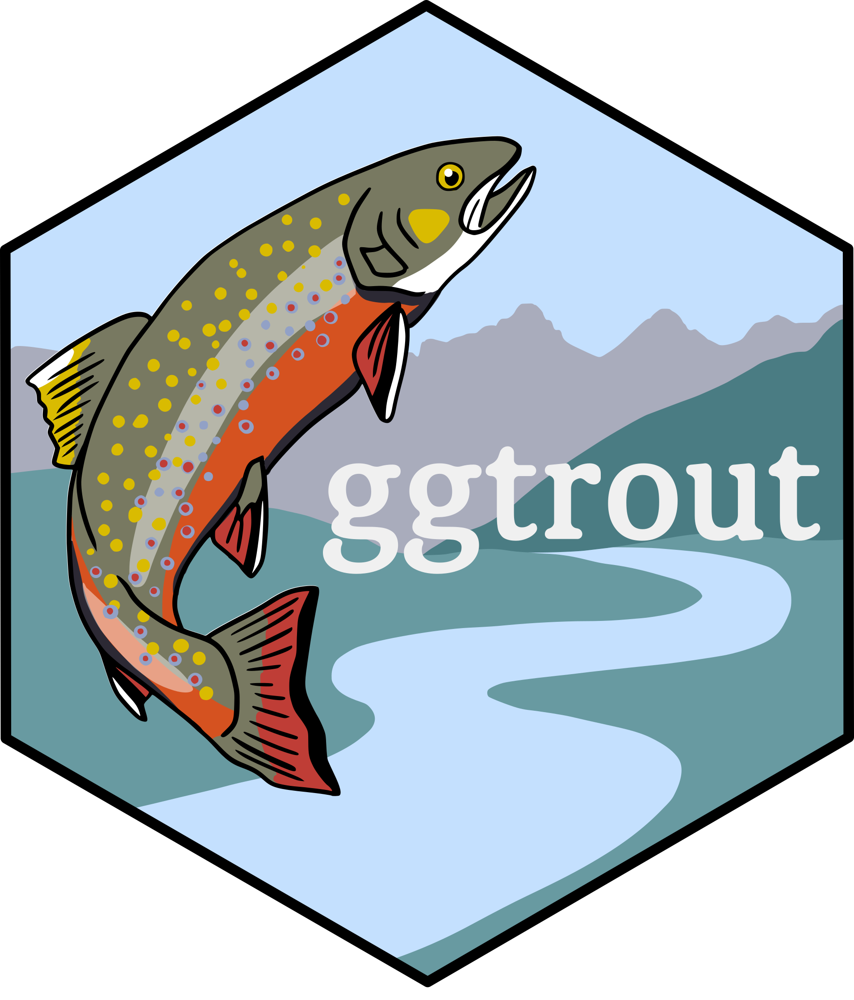
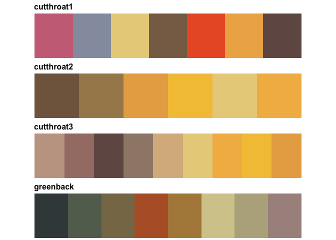
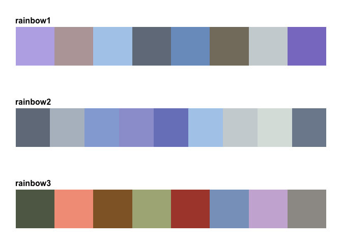
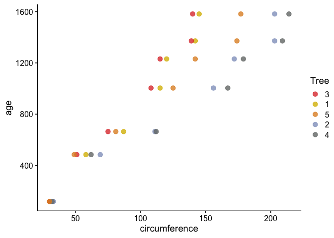

<!-- README.md is generated from README.Rmd. Please edit that file -->

# ggtrout 

Are you so obsessed with trout that you want to incorporate their
coloration into your data visualizations? Look no further! This package
provides ten color palettes inspired by several species (and subspecies)
of trout that inhabit pristine habitats across the United States. The
package’s framework is designed for use in the tidyverse but can also be
used for base R plotting.

## Installation

------------------------------------------------------------------------

The ggtrout package is only available on GitHub and so must be installed
using the devtools package:

``` r
devtools::install_github("eachambers/ggtrout")
```

Libraries you’ll want to load to use the package are as follows:

``` r
library(ggtrout)
library(tidyverse)
library(cowplot)
theme_set(theme_cowplot())
```

## Palettes

------------------------------------------------------------------------


There are 10 palettes available in the ggtrout package, each named based
on the species for which the palette is inspired. Five are qualitative,
three are diverging, and two are monochromatic. Let’s go through all the
palettes, grouped by (sub)species. In general, you can access and view
the palettes using the `ggtrout_palette()` function:

``` r
# ggtrout_palette("brook1")
```

### Brook trout

Brook trout (*Salvelinus fontinalis*), when breeding, have bright
orange-red pelvic and pectoral fins and brilliant red lateral spots
ringed with a grey-blue. There are three brookie-inspired palettes:

``` r
grid_palettes("brook")
```


### Cutthroat trout

Cutthroat trout (*Oncorhynchus clarkii*) are named for their bright
blood-red fin arch coloration. This species has many subspecies, and the
ggtrout package is inspired by two Coloradan subspecies: the Colorado
River cutthroat (*O. c. pleuriticus*) and the greenback cutthroat (*O.
c. stomias*). The greenback has a fun history: it was presumed extinct
in the 1930s until its rediscovery in a restricted river basin in
Colorado in 1957. Since then, massive conservation efforts have been
focused on reintroducing the subspecies into its historic range; the
greenback is also the state fish of Colorado! There are four
cuttie-inspired palettes:

``` r
grid_palettes("cutthroat")
```



### Rainbow trout

Rainbow trout (*Oncorhynchus mykiss*) is a widely distributed species
that has been introduced to freshwater habitats across the U.S. so it’s
generally a little less exciting than the other trout. Their coloration
is quite stunning though! There are three rainbow-inspired palettes:

``` r
grid_palettes("rainbow")
```



## Examples

------------------------------------------------------------------------

Below are some examples of using the ggtrout palettes. As you can see,
the palettes are designed to be used with ggplot2 syntax.

``` r
ggplot(Orange, aes(x = circumference, y = age, color = Tree)) +
  geom_point(size = 3, alpha = 0.8) +
  scale_color_manual(values = ggtrout_palette("brook1"))
```



``` r

pal <- ggtrout_palette("greenback", 12, type = "continuous")
image(volcano, col = pal)
```


``` r

ggplot(faithfuld, aes(waiting, eruptions)) +
  geom_raster(aes(fill = density), interpolate = TRUE) +
  scale_fill_gradientn(colors = ggtrout_palette("cutthroat2"))
```


The package also has some fun Colorado-themed example datasets which can
be loaded using the `load_trout_example()` function.

``` r
load_trout_example()
#> 
#> ---------------- Example data ----------------
#>  
#> Objects loaded: 
#> *chibasin* elevation data for the Chicago Basin, CO 
#> *bluelakes* elevation data for Blue Lakes, CO 
#> *animas* Daily water temperature for the Animas River from 2016-2023 
#> 
#> -------------------------------------------------
#> 
```

Let’s take a look at the digital elevation map for the Chicago Basin and
surrounding area using a diverging palette:

``` r
pal <- ggtrout_palette("cutthroat3", 100, type = "continuous")
ggplot(chibasin, aes(x, y, fill = elevation)) +
  geom_raster() +
  coord_equal() +
  scale_fill_gradientn(colors = pal, trans = "reverse") +
  theme_void()
```


Or the DEM for Blue Lakes using a different diverging palette:

``` r
pal <- ggtrout_palette("brook3", 100, type = "continuous")
ggplot(bluelakes, aes(x, y, fill = elevation)) +
  geom_raster() +
  coord_equal() +
  scale_fill_gradientn(colors = pal) +
  theme_void()
```


Or we could take a look at daily water temperature of the Animas River
(measured in Durango, CO) from 2016 to 2023 using a qualitative palette:

``` r
ggplot(animas, aes(x = date, y = water_temp, group = year, color = year)) +
  geom_line(alpha = 0.75) +
  theme(axis.text.x = element_blank(),
        axis.ticks.x = element_blank()) +
  xlab("Date") +
  ylab("Water temperature (Celsius)") +
  ggtitle("Animas River water temperature (2016-2023)") +
  scale_color_manual(values = ggtrout_palette("rainbow3")) +
  facet_grid(~year)
```


## Other functions in ggtrout

------------------------------------------------------------------------

``` r
# See all available palettes
names(ggtrout_palettes)
#>  [1] "brook1"     "brook2"     "brook3"     "cutthroat1" "cutthroat2"
#>  [6] "cutthroat3" "rainbow1"   "rainbow2"   "rainbow3"   "greenback"
```

You can have ggtrout tell you which is which using the `ggtrout_types()`
function. For example:

``` r
# For an individual palette's type:
ggtrout_type("rainbow2")
#> [1] "diverging"

# For only monochromatic palettes:
ggtrout_type("monochromatic")
#> [1] "brook2"     "cutthroat2"

# For all palettes:
ggtrout_type("all")
#>          brook1          brook2          brook3      cutthroat1      cutthroat2 
#>   "qualitative" "monochromatic"     "diverging"   "qualitative" "monochromatic" 
#>      cutthroat3        rainbow1        rainbow2        rainbow3       greenback 
#>     "diverging"   "qualitative"     "diverging"   "qualitative"   "qualitative"
```

You can check the degree of colorblind friendliness for each of the
ggtrout palettes using the `ggtrout_cb()` function. In general, the
diverging palettes (i.e., “brook1”, “cutthroat1”, and “rainbow1”) are
the most colorblind friendly. This function uses the `palette_check()`
function in the colorblindcheck package; a general rule of thumb is to
select palettes that have a min_dist of \~8 for all color vision
deficiencies.

``` r
library(colorblindcheck)
ggtrout_cb("brook1")
#>           name n tolerance ncp ndcp  min_dist mean_dist max_dist
#> 1       normal 7  19.52755  21   21 19.527555  34.70396 53.60330
#> 2 deuteranopia 7  19.52755  21   18  7.047038  30.32271 51.01541
#> 3   protanopia 7  19.52755  21   18 10.091720  30.91520 52.07805
#> 4   tritanopia 7  19.52755  21   17 12.176371  31.64165 52.09485
```

## Acknowledgements

------------------------------------------------------------------------

Much of my code, and the general structure of this package, was inspired
by the `wesanderson` package developed by Karthik Ram (find it
[here](https://github.com/karthik/wesanderson)), and the
`NatParksPalettes` package developed by Kevin Blake (find it
[here](https://github.com/kevinsblake/NatParksPalettes)). For advice on
use of color in data visualization, I highly recommend the wonderful and
fully open access *Fundamentals of Data Visualization* textbook by Claus
Wilke, available online [here](https://clauswilke.com/dataviz/).
